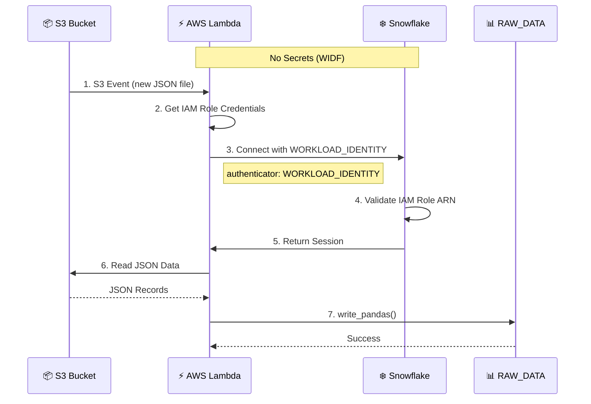

# 🔐 Snowpark WIDF Lambda Loader

**Keyless ETL: AWS Lambda → Snowflake**

Demonstrates Snowflake [Workload Identity Federation (WIDF)](https://docs.snowflake.com/en/user-guide/workload-identity-federation) with AWS Lambda. No passwords, no secrets, no key pairs - just IAM trust.

## How It Works

When a JSON file lands in S3, Lambda loads it into Snowflake using WIDF for authentication. The Lambda's IAM role is trusted directly by Snowflake - no credentials to manage or rotate.



## 📋 Prerequisites

| Tool | Purpose | Installation |
|------|---------|--------------|
| [Docker](https://www.docker.com/products/docker-desktop/) | Container builds | [Install](https://www.docker.com/products/docker-desktop/) |
| [AWS CLI](https://aws.amazon.com/cli/) | AWS operations | [Install](https://docs.aws.amazon.com/cli/latest/userguide/getting-started-install.html) |
| [AWS SAM CLI](https://aws.amazon.com/serverless/sam/) | Lambda deployment | [Install](https://docs.aws.amazon.com/serverless-application-model/latest/developerguide/install-sam-cli.html) |
| [Snowflake CLI](https://docs.snowflake.com/en/developer-guide/snowflake-cli-v2/index) | SQL scripts | [Install](https://docs.snowflake.com/en/developer-guide/snowflake-cli-v2/installation/installation) |
| [Task](https://taskfile.dev/) | Task runner | [Install](https://taskfile.dev/installation/) |
| [uv](https://docs.astral.sh/uv/) | Python packages | [Install](https://docs.astral.sh/uv/getting-started/installation/) |

> [!TIP]
> Run `task` to see all available commands.

## 🚀 Setup

### 1. Configure Environment

```bash
cp env.example .env
```

Edit `.env` with your AWS and Snowflake account details.

### 2. Verify Configuration

```bash
task default
```

### 3. Check Prerequisites

```bash
# Verify AWS CLI connectivity
task aws:check

# Verify SAM CLI installed
task aws:check-sam
```

---

## 🎬 Demo Walkthrough

### Part I: Deploy Without WIDF → Watch It Fail ❌

#### 1. Setup Snowflake Database

```bash
task snow:setup
```

Creates database, schema, role, and RAW_DATA table.

#### 2. Deploy AWS Resources

```bash
task aws:deploy
```

Deploys Lambda function, S3 bucket with trigger, and IAM role.

#### 3. Get the Lambda Role ARN

```bash
task aws:role-arn
```

> [!IMPORTANT]
> Save this ARN - you'll need it for Part II.

#### 4. Upload Test Data

```bash
task aws:test
```

#### 5. Watch the Logs

```bash
task aws:logs
```

**Expected error:** Snowflake doesn't recognize the Lambda's IAM role yet.

```
Connecting to Snowflake using WORKLOAD_IDENTITY
   Account: your_account
   User: LAMBDA_LOADER_BOT
Found credentials in environment variables.
Lambda failed: 250001 (08001): Failed to connect to DB. 
   Unable to find an associated Snowflake user for the verified 
   AWS Caller Identity with ARN 'arn:aws:sts::123456789012:assumed-role/snowpark-widf-lambda-role-dev/...'
```

> [!NOTE]
> This error confirms WIDF is working on the AWS side - Lambda's IAM identity was verified.
> Snowflake just doesn't have a user that trusts this ARN yet.

---

### Part II: Configure WIDF → Watch It Succeed ✅

#### 1. Create WIDF Service User

```bash
task snow:lambda-wid
```

This creates a SERVICE user that trusts the Lambda's IAM role:

```sql
CREATE USER LAMBDA_LOADER_BOT
  TYPE = SERVICE
  WORKLOAD_IDENTITY = (
    TYPE = AWS
    ARN = 'arn:aws:iam::123456789012:role/snowpark-widf-lambda-role-dev'
  );
```

#### 2. Upload Test Data Again

```bash
task aws:test
```

#### 3. Watch the Logs

```bash
task aws:logs
```

**Expected:** Successful connection and data load via WIDF.

#### 4. Verify Data

```bash
task snow:query
```

---

## 🔑 The Key

```python
connection_params = {
    "account": "...",
    "authenticator": "WORKLOAD_IDENTITY",   # ← WIDF keyless auth
    "workload_identity_provider": "AWS",
    # NO password, NO secret key, NO key pair
}
```

---

## 📁 Project Structure

```
├── app.py                 # Lambda handler (Snowpark + WIDF)
├── Dockerfile             # Container image for Lambda
├── test_app.py            # Integration tests
├── Taskfile.yml           # All automation tasks
├── aws/
│   └── template.yaml      # SAM template (Lambda, S3, IAM)
├── scripts/
│   ├── setup.sql          # Snowflake DB/schema setup
│   ├── lambda-wid.sql     # WIDF service user creation
│   └── cleanup.sql        # Remove all Snowflake resources
└── data/
    └── sample-data.json   # Test data
```

---

## 📖 Quick Reference

| Command | Description |
|---------|-------------|
| `task default` | Show configuration |
| `task test` | Run integration tests |
| `task snow:setup` | Create Snowflake DB/schema/table |
| `task aws:deploy` | Deploy Lambda + S3 |
| `task snow:lambda-wid` | Create WIDF service user |
| `task aws:test` | Upload test data |
| `task aws:logs` | Tail CloudWatch logs |
| `task aws:role-arn` | Get Lambda Role ARN |
| `task deploy` | Full deployment (AWS + WIDF) |
| `task clean:all` | Cleanup everything |

<details>
<summary>More commands</summary>

| Command | Description |
|---------|-------------|
| `task aws:check` | Verify AWS CLI connectivity |
| `task aws:check-sam` | Check SAM CLI installed |
| `task aws:setup-sam-bucket` | Create SAM artifact bucket |
| `task aws:debug` | Debug CloudFormation errors |
| `task aws:clean-stack` | Delete failed stack |
| `task snow:query` | Query RAW_DATA table |
| `task snow:cleanup` | Remove Snowflake resources |

</details>

---

## 🔧 Troubleshooting

### AWS Deployment Errors

**Stack stuck in ROLLBACK_COMPLETE:**

```bash
task aws:clean-stack
task aws:deploy
```

> [!NOTE]
> **"s3:PutBucketPublicAccessBlock" denied?**  
> Add `SAM_S3_BUCKET` to `.env` with an existing bucket you can write to.

### Snowflake WIDF Errors

**Verify WIDF user exists:**

```bash
snow sql -q "SHOW USERS LIKE 'LAMBDA_LOADER_BOT';"
```

**Check WIDF configuration:**

```bash
snow sql -q "SHOW USER WORKLOAD IDENTITY AUTHENTICATION METHODS FOR USER LAMBDA_LOADER_BOT;"
```

---

## 🧹 Cleanup

```bash
# Remove AWS resources only
task aws:clean

# Remove Snowflake resources only
task snow:cleanup

# Clean everything
task clean:all
```

---

## 📚 References

- [Snowflake Workload Identity Federation](https://docs.snowflake.com/en/user-guide/workload-identity-federation)
- [Snowflake Python Connector - Pandas](https://docs.snowflake.com/en/developer-guide/python-connector/python-connector-pandas)
- [AWS SAM CLI](https://docs.aws.amazon.com/serverless-application-model/latest/developerguide/what-is-sam.html)
- [Snowflake CLI](https://docs.snowflake.com/en/developer-guide/snowflake-cli-v2/index)

## License

[Apache 2.0](LICENSE)
