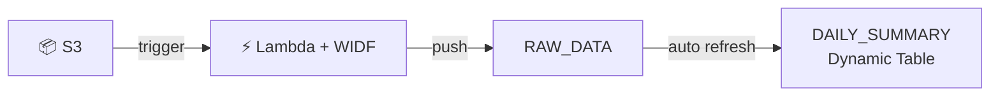
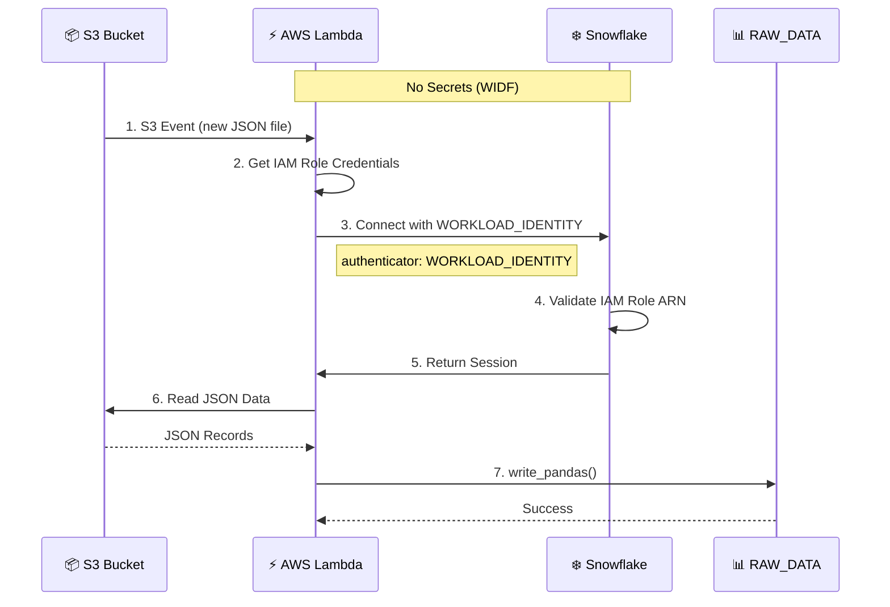

# 🔐 Snowpark WIDF Lambda Loader

> Keyless ETL: AWS Lambda → Snowflake

Demonstrates Snowflake [Workload Identity Federation (WIDF)](https://docs.snowflake.com/en/user-guide/workload-identity-federation) with AWS Lambda. No passwords, no secrets, no key pairs - just IAM trust.

## Why WIDF?

| | Traditional | WIDF |
| - | ----------- | ---- |
| **Credentials** | Password or key pair stored in Secrets Manager | None - IAM role is the identity |
| **Rotation** | Manual or automated rotation required | Nothing to rotate |
| **Leak risk** | Secrets can be exposed in logs, env vars | No secrets to leak |
| **Audit** | "Which service used this password?" | "IAM role X accessed at time Y" |
| **Setup** | Create user + password + store secret | Create user + trust IAM ARN |
| **Cost** | Secrets Manager charges per secret/access | Free |

## When to Use This

Snowflake offers multiple ways to load data from S3. Choose based on your needs:

| Approach | Pattern | Best For |
| -------- | ------- | -------- |
| [External Stage + Snowpipe](https://docs.snowflake.com/en/user-guide/data-load-s3) | Snowflake **pulls** | Bulk file ingestion, raw landing zones |
| Lambda + WIDF | You **push** | Smart ingestion with pre-load logic |

**Lambda + WIDF shines when you need:**

- **Data quality gates** - Validate/reject files before loading
- **Real-time enrichment** - Call APIs during ingestion
- **Conditional routing** - Route to different tables based on content
- **Event context** - Capture S3 metadata (who uploaded, when, from where)
- **Zero credential management** - WIDF handles auth

### Add Dynamic Tables for Instant Analytics

Lambda + WIDF gets data in. [Dynamic Tables](https://docs.snowflake.com/en/user-guide/dynamic-tables-about) turn it into insights - automatically. Define your transformation query once; Snowflake handles refresh scheduling, dependency tracking, and incremental processing.



The setup script creates `DAILY_SUMMARY` that auto-refreshes as data lands:

| Question | Answer |
| -------- | ------ |
| How many files landed today? | `files_loaded` |
| What's our event volume? | `total_events` by `action` |
| Daily purchase total? | `total_amount` |

> [!NOTE]
> External Stage is great for bulk ingestion. Lambda + WIDF + Dynamic Tables delivers smart pipelines with built-in analytics.

## How It Works

When a JSON file lands in S3, Lambda loads it into Snowflake using WIDF for authentication. The Lambda's IAM role is trusted directly by Snowflake - no credentials to manage or rotate.



## 📋 Prerequisites

### Snowflake

1. **Snowflake Account** - [Sign up for a free trial](https://bit.ly/snow-india-meetups)

2. **Snowflake CLI** - [Install](https://docs.snowflake.com/en/developer-guide/snowflake-cli-v2/installation/installation) and [configure connection](https://docs.snowflake.com/en/developer-guide/snowflake-cli/connecting/connect)

> [!TIP]
> Use [OAuth for local applications](https://docs.snowflake.com/en/user-guide/oauth-local-applications) for passwordless Snowflake CLI authentication. Set `authenticator = "OAUTH_AUTHORIZATION_CODE"` in your connection config.

### Tools

| Tool | Purpose | Installation |
| ---- | ------- | ------------ |
| [Docker](https://www.docker.com/products/docker-desktop/) | Container builds | [Install](https://www.docker.com/products/docker-desktop/) |
| [AWS CLI](https://aws.amazon.com/cli/) | AWS operations | [Install](https://docs.aws.amazon.com/cli/latest/userguide/getting-started-install.html) |
| [AWS SAM CLI](https://aws.amazon.com/serverless/sam/) | Lambda deployment | [Install](https://docs.aws.amazon.com/serverless-application-model/latest/developerguide/install-sam-cli.html) |
| [Task](https://taskfile.dev/) | Task runner | [Install](https://taskfile.dev/installation/) |

### Python Environment (choose one)

| Option | Tool | Installation |
| ------ | ---- | ------------ |
| A | [uv](https://docs.astral.sh/uv/) (recommended) | [Install](https://docs.astral.sh/uv/getting-started/installation/) |
| B | Python venv | Built-in with Python 3.11+ |

Using venv instead of uv:

```bash
python -m venv .venv
source .venv/bin/activate  # On Windows: .venv\Scripts\activate
pip install -r requirements.txt
```

> [!TIP]
> Run `task` to see all available commands.

## 🚀 Setup

### 1. Configure Environment

```bash
cp env.example .env
```

Edit `.env` with your AWS and Snowflake account details.

### 2. Verify Configuration

```bash
task default
```

### 3. Check Prerequisites

```bash
# Verify AWS CLI connectivity
task aws:check

# Verify SAM CLI installed
task aws:check-sam
```

---

## 🎬 Demo Walkthrough

### Quick Demo (One Command Each)

```bash
# Part I: Deploy without WIDF → Watch it fail
task demo:fail

# Part II: Configure WIDF → Watch it succeed  
task demo:success

# Cleanup when done
task demo:clean
```

### Part I: Deploy Without WIDF → Watch It Fail ❌

#### 1. Setup Snowflake Database

```bash
task snow:setup
```

Creates database, schema, role, and RAW_DATA table.

#### 2. Deploy AWS Resources

```bash
task aws:deploy
```

Deploys Lambda function, S3 bucket with trigger, and IAM role.

#### 3. Get the Lambda Role ARN

```bash
task aws:role-arn
```

> [!IMPORTANT]
> Save this ARN - you'll need it for Part II.

#### 4. Upload Test Data

```bash
task aws:test
```

#### 5. Watch the Logs

```bash
task aws:logs
```

**Expected error:** Snowflake doesn't recognize the Lambda's IAM role yet.

```text
Connecting to Snowflake using WORKLOAD_IDENTITY
   Account: your_account
   User: LAMBDA_LOADER_BOT
Found credentials in environment variables.
Lambda failed: 250001 (08001): Failed to connect to DB. 
   Unable to find an associated Snowflake user for the verified 
   AWS Caller Identity with ARN 'arn:aws:sts::123456789012:assumed-role/snowpark-widf-lambda-role-dev/...'
```

> [!NOTE]
> This error confirms WIDF is working on the AWS side - Lambda's IAM identity was verified.
> Snowflake just doesn't have a user that trusts this ARN yet.

---

### Part II: Configure WIDF → Watch It Succeed ✅

#### 1. Create WIDF Service User

```bash
task snow:lambda-wid
```

This creates a SERVICE user that trusts the Lambda's IAM role:

```sql
CREATE USER LAMBDA_LOADER_BOT
  TYPE = SERVICE
  WORKLOAD_IDENTITY = (
    TYPE = AWS
    ARN = 'arn:aws:iam::123456789012:role/snowpark-widf-lambda-role-dev'
  );
```

#### 2. Upload Test Data Again

```bash
task aws:test
```

#### 3. Watch the Logs

```bash
task aws:logs
```

**Expected:** Successful connection and data load via WIDF.

#### 4. Verify Data

```bash
# Raw landing data
task snow:query

# Real-time analytics (Dynamic Table)
task snow:query-summary
```

---

## 🔑 The Key

```python
connection_params = {
    "account": "...",
    "authenticator": "WORKLOAD_IDENTITY",   # ← WIDF keyless auth
    "workload_identity_provider": "AWS",
    # NO password, NO secret key, NO key pair
}
```

---

## 📖 Commands

### Demo

| Command | Description |
| ------- | ----------- |
| `task demo:fail` | Part I - deploy without WIDF, show failure |
| `task demo:success` | Part II - configure WIDF, show success |
| `task demo:clean` | Cleanup all resources |

### Snowflake Commands

| Command | Description |
| ------- | ----------- |
| `task snow:setup` | Create DB/schema/table/dynamic table |
| `task snow:lambda-wid` | Create WIDF service user |
| `task snow:query` | Query RAW_DATA (landing) |
| `task snow:query-summary` | Query DAILY_SUMMARY (analytics) |
| `task snow:cleanup` | Remove Snowflake resources |

### AWS

| Command | Description |
| ------- | ----------- |
| `task aws:check` | Verify AWS CLI connectivity |
| `task aws:check-sam` | Check SAM CLI installed |
| `task aws:deploy` | Deploy Lambda + S3 |
| `task aws:test` | Upload test data |
| `task aws:logs` | Tail CloudWatch logs |
| `task aws:logs-recent` | Show recent logs (last 30 min) |
| `task aws:role-arn` | Get Lambda Role ARN |
| `task aws:debug` | Debug CloudFormation errors |
| `task aws:clean-stack` | Delete failed stack |
| `task aws:empty-bucket` | Empty S3 bucket |
| `task aws:clean` | Remove AWS resources |

### Other

| Command | Description |
| ------- | ----------- |
| `task default` | Show configuration |
| `task test` | Run integration tests |
| `task deploy` | Full deployment (AWS + WIDF) |
| `task clean:all` | Cleanup everything |

---

## 🔧 Troubleshooting

### AWS Deployment Errors

**Stack stuck in ROLLBACK_COMPLETE:**

```bash
task aws:clean-stack
task aws:deploy
```

> [!NOTE]
> **"s3:PutBucketPublicAccessBlock" denied?**  
> This is typically caused by an organization-level Service Control Policy (SCP) that prevents users from modifying S3 public access settings. Add `SAM_S3_BUCKET` to `.env` with an existing bucket you have write access to.

### Snowflake WIDF Errors

**Verify WIDF user exists:**

```bash
snow sql -q "SHOW USERS LIKE 'LAMBDA_LOADER_BOT';"
```

**Check WIDF configuration:**

```bash
snow sql -q "SHOW USER WORKLOAD IDENTITY AUTHENTICATION METHODS FOR USER LAMBDA_LOADER_BOT;"
```

---

## 🧹 Cleanup

Remove AWS resources only

```bash
task aws:clean
```

Remove Snowflake resources only

```bash
task snow:cleanup
```

Clean everything

```bash
task clean:all
```

---

## 📚 References

- [Snowflake Workload Identity Federation](https://docs.snowflake.com/en/user-guide/workload-identity-federation)
- [Snowflake Dynamic Tables](https://docs.snowflake.com/en/user-guide/dynamic-tables-about) - Declarative data pipelines with automatic refresh
- [Snowpark Python](https://docs.snowflake.com/en/developer-guide/snowpark/python) - DataFrame API for Python
- [Snowflake Python Connector - Pandas](https://docs.snowflake.com/en/developer-guide/python-connector/python-connector-pandas)
- [AWS SAM CLI](https://docs.aws.amazon.com/serverless-application-model/latest/developerguide/what-is-sam.html)
- [Snowflake CLI](https://docs.snowflake.com/en/developer-guide/snowflake-cli-v2/index)

## License

Copyright (c) Kamesh Sampath. All rights reserved. Licensed under the [Apache 2.0 license](LICENSE).
